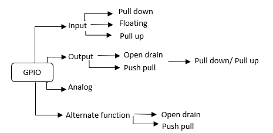
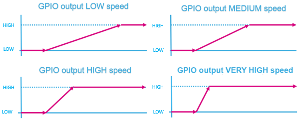
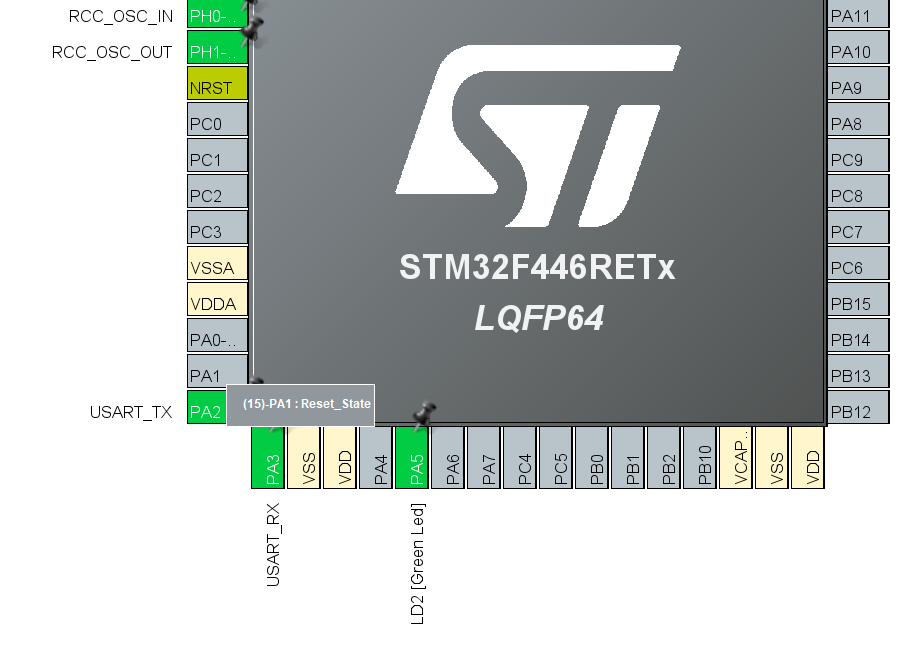
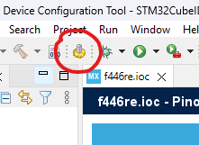
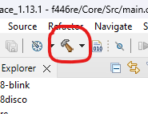
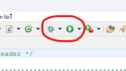
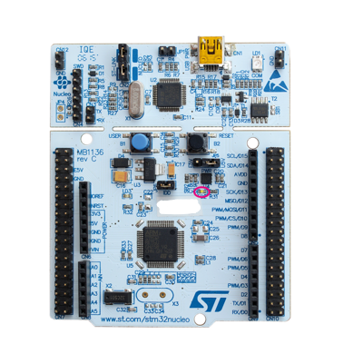

# Getting Started with GPIO on STM32
## Introduction to GPIO
- **What is GPIO?**
  - General Purpose Input/Output (GPIO) pins allow microcontrollers to interact with other hardware.
  - GPIO pins can be configured as input or output to read signals from sensors or control devices like LEDs.
  
  

## GPIO Features on STM32
- **Key Features:**
  - **Configurable Modes**: Input, output, analog, and alternate function modes.
  - **Internal Resistors**: Pull-up and pull-down resistors help stabilize the input signal.
  - **Interrupt Capability**: GPIO pins can generate interrupts on rising, falling, or both edges.
  - **Speed Settings**: Different speed settings for output pins (low, medium, high, and very high).

    

## Required Tools and Setup
- **Tools:**
  - **Hardware**: STM32F446RE Nucleo Board.
  - **Software**: STM32CubeIDE and the HAL Library for hardware abstraction.
- **Setup:**
  - Install STM32CubeIDE on your PC.
  - Connect the Nucleo board to your PC using a USB cable.

## Creating a New Project
- **Steps:**
  - **Open STM32CubeIDE**: Start the IDE and create a new project.

  - **Select Board**: Choose NUCLEO-F446RE from the board selector.
  - **Initialize Project**: Name your project and initialize it with default settings.

## Configuring GPIO Pins
- **Using STM32CubeMX:**
  - **Open Pinout & Configuration**: Use the graphical interface to configure pins.
  - **Set Pin Mode**: Select a pin (e.g., PA5) and set it to GPIO_Output.
  
  - **Configure Settings**: Set the speed, pull-up/pull-down resistors, and initial state (or leave it as default)

## Code Generation
- **Generate Initialization Code:**
  - **Generate Code**: Click on "Generate Code" to create the necessary initialization code.

    
  - **Open main.c**: Navigate to `main.c` where the main application code resides.

## Writing Code in main.c
- **Example Code:**
  - **Initialize GPIO**: Ensure GPIO initialization code is in `main.c`.
  - **Toggle LED**: Add code to toggle an LED connected to PA5.
    ```c
    while (1) {
        HAL_GPIO_TogglePin(GPIOA, GPIO_PIN_5);
        HAL_Delay(500); // 500 ms delay
    }
    ```

## Building and Flashing
- **Compile and Flash:**
  - **Build Project**: Click on the build button to compile the code.
  
  - **Flash Binary**: Use the "Debug" or "Run" button to flash the binary to the Nucleo board.

    

## Testing the Application
- **Verification:**
  - **Observe LED**: Check that the LED connected to PA5 toggles on and off every 500 ms.
  - **Debugging**: If the LED does not toggle, check connections and code for errors.

    

## Conclusion
- **Summary:**
  - **Configured GPIO**: Successfully configured GPIO pin as output.
  - **Code Implementation**: Wrote code to toggle an LED.
  - **Project Deployment**: Compiled and flashed the code, verifying functionality.
